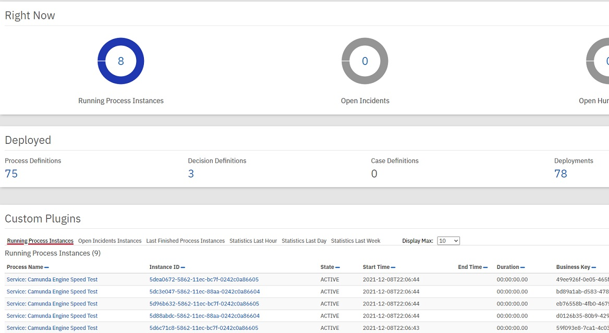
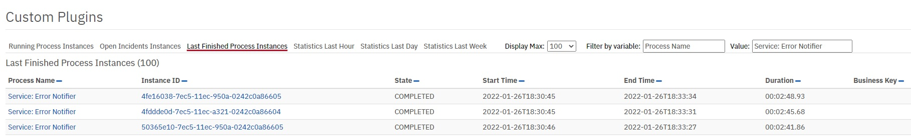
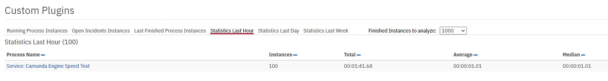

# Camunda process statistics plugin
Camunda BPM community extension providing a process statistics plugin for Camunda Cockpit 7.14+   
Insired by Asko Soukka History Plugin https://github.com/datakurre/camunda-cockpit-plugins   



Plugin consists of 6 interactive reports available in Camunda Dashbord:   
1. Running Process Instances   
2. Open Incident Instances (running processes with incidents)   
3. Last Finished Processes (limited to 1000)   

4. Finished Processes - Statistics (last hour)   

5. Finished Processes - Statistics (last day)   
6. Finished Processes - Statistics (last week)   
All statistics reports analize max 100000 last finished processes and count stats data.   

## Installation
1. Just copy process-statistics.js file to camunda cockpit scripts directory.   
2. Register plugin by editing config.js file in camunda cockpit scripts directory.   

```
  customScripts: [
    'scripts/process-statistics.js'
  ],
```

Plugin uses Camunda History Database. To follow links from Finished Processes tabs, so I recommend to install also Asko History Plugin.   
