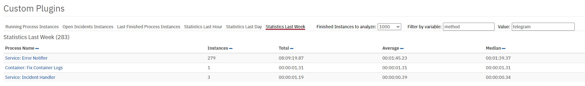

# camunda-process-statistics-plugin
Camunda BPM community extension providing a process statistics plugin for Camunda Cockpit 7.14+   
Insired by Asko Soukka History Plugin https://github.com/datakurre/camunda-cockpit-plugins   


Plugin consist of 6 interative reports available in Camunda Dashbord:   
1. Running Process Instances   
2. Open Incedent Instances - (running processes with incidents)   
3. Last Finished Processes (limited to 1000)   

4. Finished Process Statictics (last hour)   

5. Finished Process Statictics (last day)   
6. Finished Process Statictics (last week)   
All statictics reports gets max 100000 last processes and count stats data for finished processes.   

## Installation
1. Just copy process-statistics.js file to camunda cockpit scripts directory.   
2. Register plugin by editing config.js file in camunda cockpit scripts directory.   

```
  customScripts: [
    'srcipts/process-statistics.js'
  ],
```

Plugin uses Camunda history Database. To follow links from report I recomend to install also History Plugin.   
